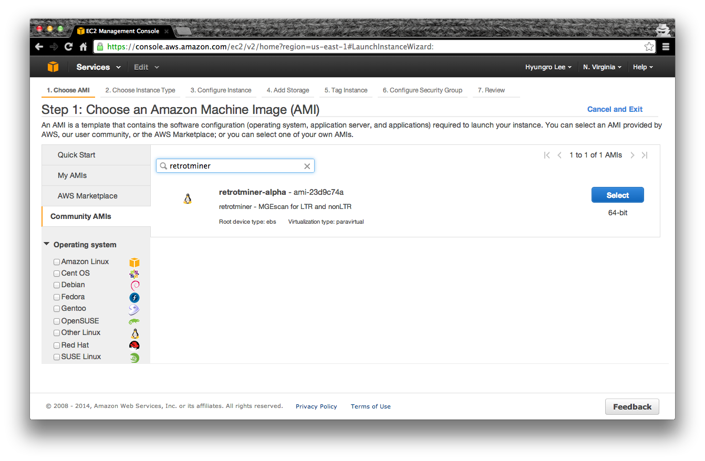

RetroTMiner on Amazon EC2
=========================

With Amazon Cloud Web Services, a virtual single or distributed system for RetroTMiner can be easily deployed. retrotminer-alpha (Amazon machine image ID: ami-23d9c74a) is available to create our Galaxy-based system for MGEScan which is identifying long terminal repeats (LTR) and non-LTR retroelements in eukaryotic genomic sequences. More cloud options will be available soon including Google Compute Engine, Microsoft Windows Azure or private cloudplatforms such as OpenStack and Eucalyptus.

Deploying RetroTMiner on the cloud
----------------------------------

First step is getting an Amazon account to launch virtual instances on Amazon IaaS platform EC2.

AWS EC2 Account
^^^^^^^^^^^^^^^
If you already have an account of Amazon AWS EC2, open AWS Management Console to launch our RetroTMiner image on EC2. Otherwise, create an AWS Account.

http://aws.amazon.com

.. image:: images/aws-management-console.png

RetroTMiner Image
^^^^^^^^^^^^^^^^^^^^^^^^^

In AWS Management Console, open *EC2 Dashboard > Launch Instance*. To choose an Amazon Machine Image (AMI) of RetroTMiner, select *Community AMIs* on the left tab, and search by name or id, e.g. retrotminer or ami-23d9c74a.

RetroTMiner EC2 Image Information
""""""""""""""""""""""""""""""""""

* Image Name:retrotminer-alpha
* ID: ami-23d9c74a
* Server type: 64bit
* Description: retrotminer - MGEscan for LTR and nonLTR
* Root device type: ebs 
* Virtualization type: paravirtual

Access to RetroTMiner Instance
^^^^^^^^^^^^^^^^^^^^^^^^^^^^^^^^^^^^^^^

Once the RetroTMiner instance is launched and accessible, galaxy scientific workflow system for RetroTMiner and SSH connection are avabilable through given dns name.

[screenshot]

Ready To Use
^^^^^^^^^^^^

The RetroTMiner is now ready to conduct your experiment on Amazon EC2.

Note. Do not forget to terminate your virtual instance after all analysis completed. Amazon Cloud charges use of VM instances hourly.
